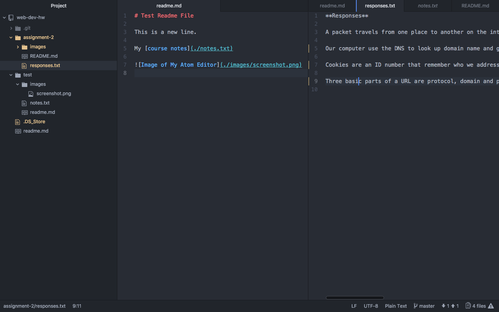

## Assignment 2

A _version control system_ is embedded in many types of software and version control  allow a developer to make changes to a file and track their changes over time, makes collaboration and sharing easier.

Please read My [responses](./responses.txt) regarding internet protocols and systems.

This assignment was difficult but rewarding for me, because
- I have never used any coding to make project so using code was hard.
- Using all of Atom, Github desktop application and web version of Github to make project was still difficult.  
- I had many issues when I was doing assignment but doing same things over and over for fixing the problem was worth it for me.

