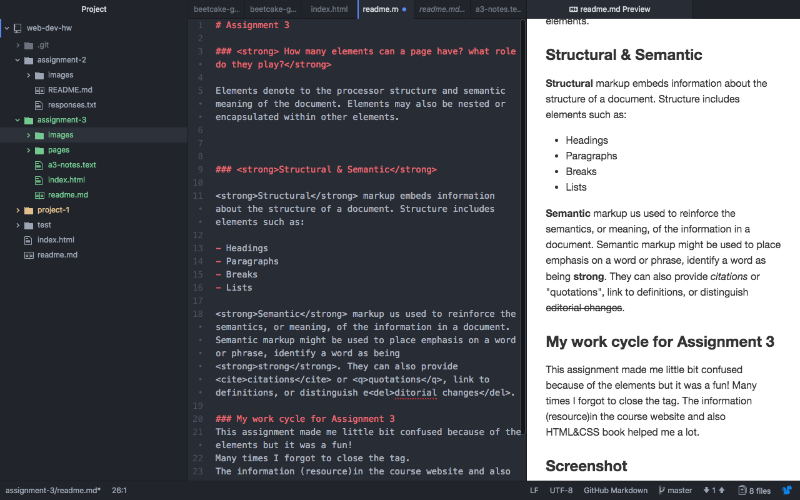

# Assignment 3

### <strong> How many elements can a page have? what role do they play?</strong>

Elements denote to the processor structure and semantic meaning of the document. Elements may also be nested or encapsulated within other elements.

### <strong>Structural & Semantic</strong>

<strong>Structural</strong> markup embeds information about the structure of a document. Structure includes elements such as:

- Headings
- Paragraphs
- Breaks
- Lists

<strong>Semantic</strong> markup us used to reinforce the semantics, or meaning, of the information in a document. Semantic markup might be used to place emphasis on a word or phrase, identify a word as being <strong>strong</strong>. They can also provide <cite>citations</cite> or <q>quotations</q>, link to definitions, or distinguish e<del>ditorial changes</del>.

### My work cycle for Assignment 3
This assignment made me little bit confused because of the elements but it was a fun!
Many times I forgot to close the tag.
The information (resource)in the course website and also HTML&CSS book helped me a lot.

### Screenshot

