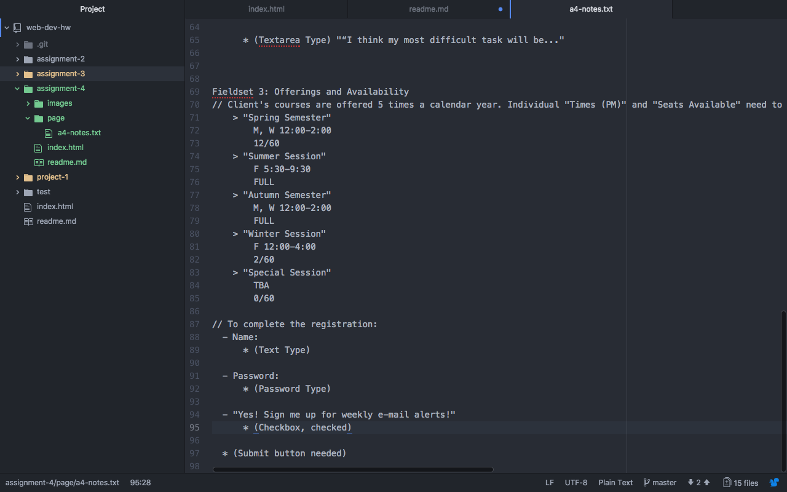

# Assignment-4

### Alt Text
 Proper style and accessibility standards dictate that we should always include the alternative text attribute. The key for this is simply alt="". The value in the double quotes should describe the image. This description is used by screen readers for those who are visually impaired.
 ### Forms
 HTML forms such as Keeping track, labels and IDs and fieldsets and legend,, etc are the forms that I have come across while browsing the web. HTML gives us several ways to manage how form data is both displayed and received.

 ### My work cycle for assignment 4
 This assignment was kind of difficult but this was rewarding me.
- It was little bit hard to manipulate images to work best for the web.
- I became understand how elements can be stringed together to better describe, present, and gather information.

### Screenshot

