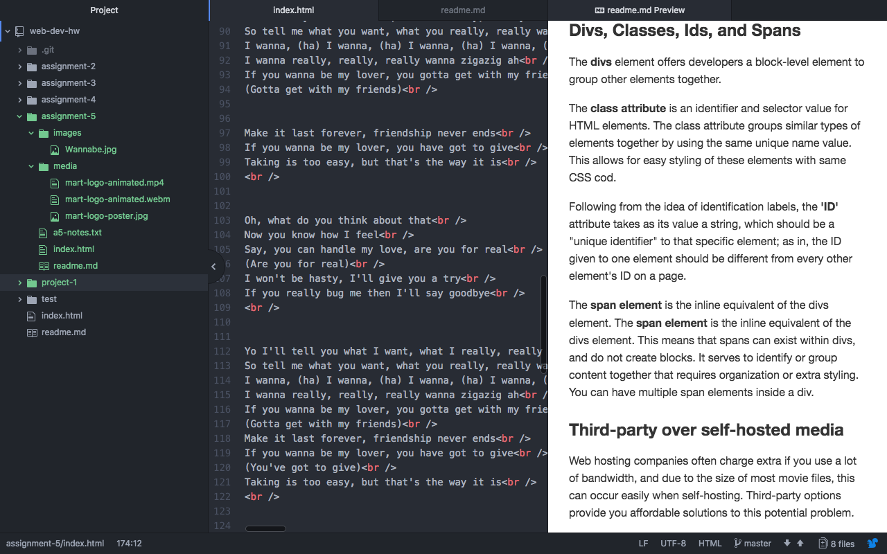

# Assignment-5

### Divs, Classes, Ids, and Spans
The <strong>divs</strong> element offers developers a block-level element to group other elements together.  

The <strong>class attribute</strong> is an identifier and selector value for HTML elements. The class attribute groups similar types of elements together by using the same unique name value. This allows for easy styling of these elements with same CSS cod.  

Following from the idea of identification labels, the <strong>'ID'</strong> attribute takes as its value a string, which should be a "unique identifier" to that specific element; as in, the ID given to one element should be different from every other element's ID on a page. 

The <strong>span element</strong> is the inline equivalent of the divs element. The <strong>span element</strong> is the inline equivalent of the divs element.
This means that spans can exist within divs, and do not create blocks. It serves to identify or group content together that requires organization or extra styling. You can have multiple span elements inside a div.

###  Third-party over self-hosted media
 Web hosting companies often charge extra if you use a lot of bandwidth, and due to the size of most movie files, this can occur easily when self-hosting. Third-party options provide you affordable solutions to this potential problem.

### My work cycle for this assignment
This assignment was little bit confused me but this was rewarding me.
- I became understand how media is placed and accessed on the internet.
- I have experimented with using divs to structure the contents of my pages.

### ScreenShot

