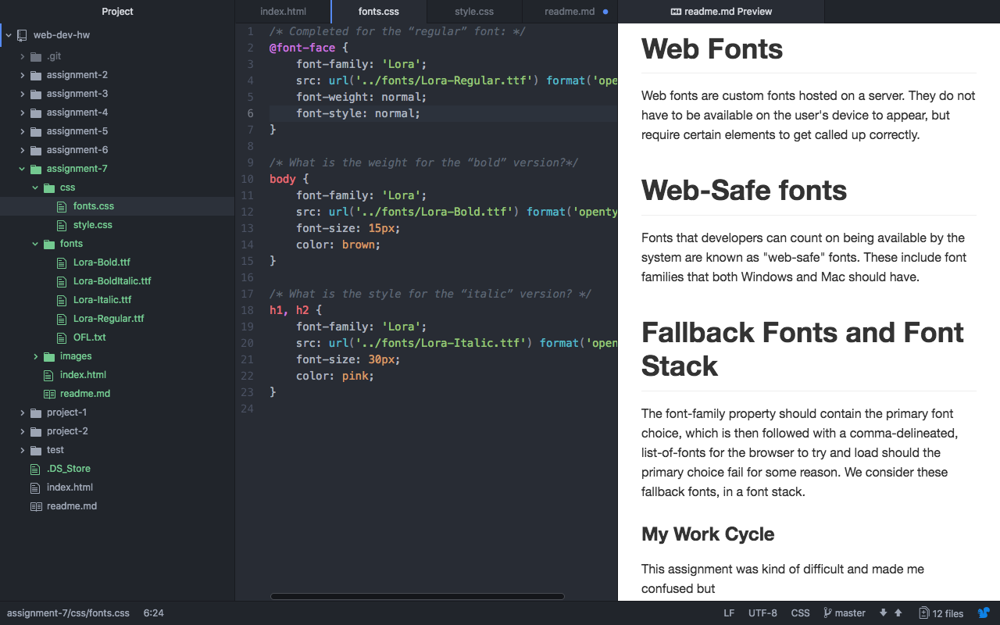

# Assignment-7

### I chose Lora font because I felt it has impact.

# System Fonts
A syestem fonts are those already installed on your local device and system. These are available to you and most programs you use, but are not necessarily to the web (usually due to licensing). Most system fonts are not set up for the web, and should be limited to usage in logos and other branding. This is because they must be exported as images, affecting both assistive technologies and search engine indexing.
# Web Fonts
Web fonts are custom fonts hosted on a server. They do not have to be available on the user's device to appear, but require certain elements to get called up correctly.
# Web-Safe fonts
Fonts that developers can count on being available by the system are known as "web-safe" fonts. These include font families that both Windows and Mac should have.
# Fallback Fonts and Font Stack
The font-family property should contain the primary font choice, which is then followed with a comma-delineated, list-of-fonts for the browser to try and load should the primary choice fail for some reason. We consider these fallback fonts, in a font stack.
### My Work Cycle
This assignment was kind of difficult and made me confused but
- I could know how to source fonts from the web.
- I Understand the difference and usage of system, web, and web-safe fonts.
- I Have considered appropriate text styling, balancing “fun” and “functionality” in your site design.

### ScreenShot

