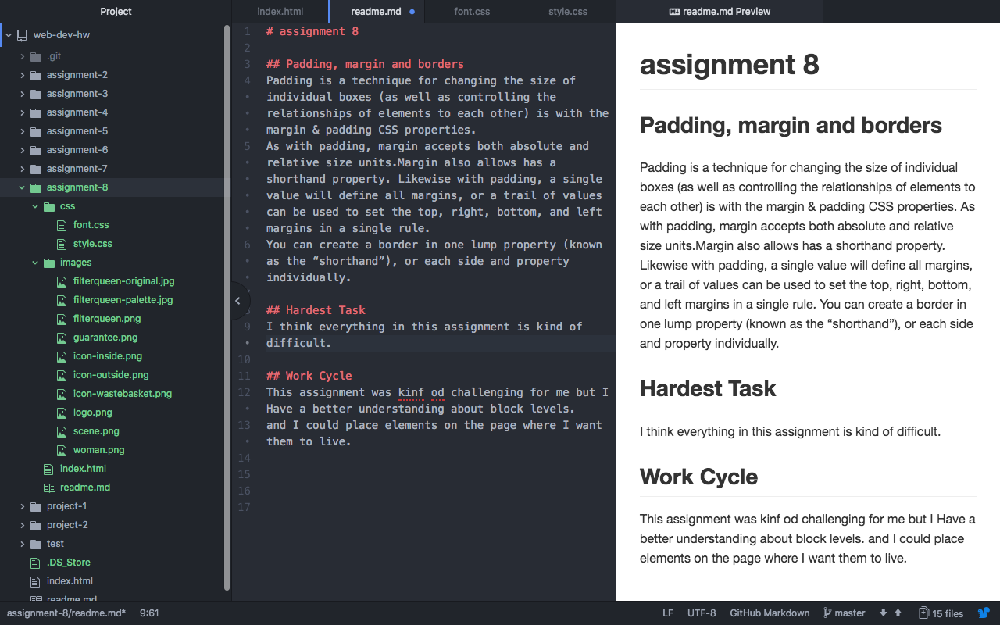

# assignment 8

## Padding, margin and borders
Padding is a technique for changing the size of individual boxes (as well as controlling the relationships of elements to each other) is with the margin & padding CSS properties.
As with padding, margin accepts both absolute and relative size units.Margin also allows has a shorthand property. Likewise with padding, a single value will define all margins, or a trail of values can be used to set the top, right, bottom, and left margins in a single rule.
You can create a border in one lump property (known as the “shorthand”), or each side and property individually.

## Hardest Task  
I think everything in this assignment is kind of difficult.

## Work Cycle
This assignment was kinf od challenging for me but I Have a better understanding about block levels.
and I could place elements on the page where I want them to live.

## ScreenShot

