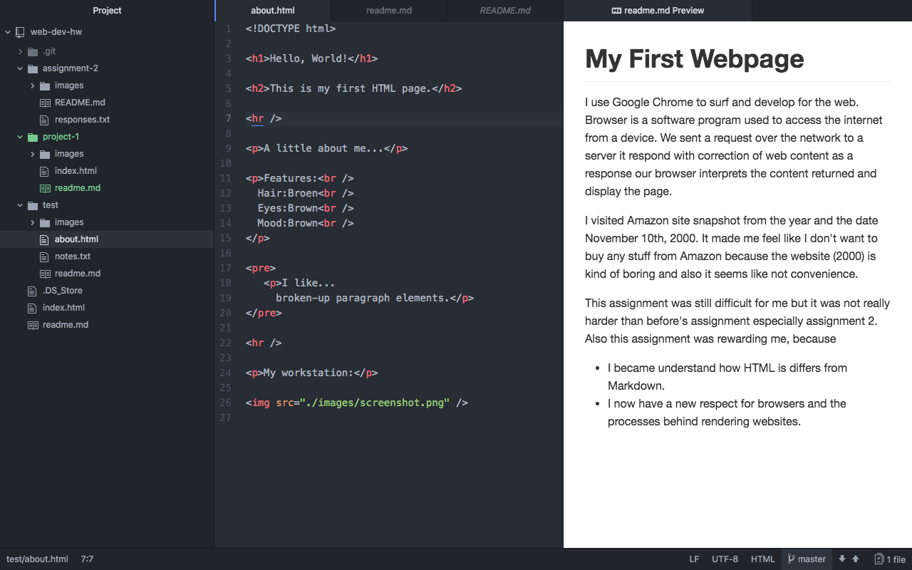

# My First Webpage

I use Google Chrome to surf and develop for the web.
Browser is a software program used to access the internet from a device. We sent a request over the network to a server it respond with correction of web content as a response our browser interprets the content returned
and display the page.

I visited Amazon site snapshot from the year and the date November 10th, 2000. It made me feel like I don't want to buy any stuff from Amazon because the website (2000) is kind of boring and also it seems like not convenience.

This assignment was still difficult for me but it was not really harder than before's assignment especially assignment 2. Also this assignment was rewarding me, because
- I became understand how HTML is differs from Markdown.
- I now have a new respect for browsers and the processes behind rendering websites.

