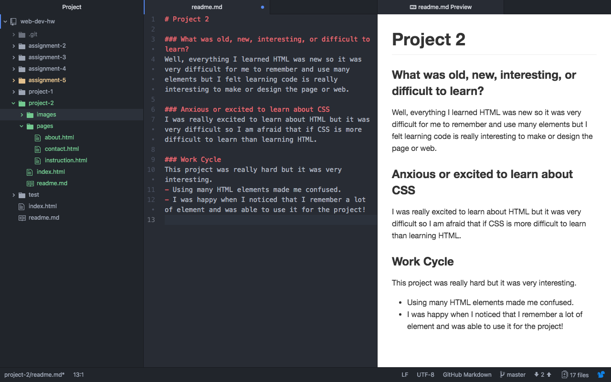

# Project 2

### What was Old, new, interesting, or difficult to learn?
Well, everything I learned HTML was new so it was very difficult for me to remember and use many elements but I felt learning code is really interesting to make or design the page or web.

### Anxious or Excited to Learn About CSS
I don't worry much about CSS because I am excited learning about it. Even learning HTML was hard, it was really exciting so I can not wait to learn about CSS!!

### Work Cycle
This project was really hard but it was very interesting.
- Using many HTML elements made me confused.
- I was happy when I noticed that I remember a lot of element and was able to use it for the project!

### ScreenShot

